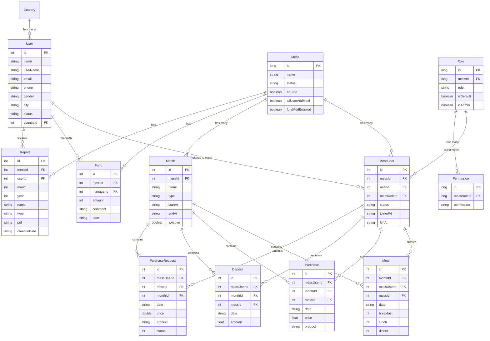

# **Meal Management App - Data Model Relationships & Architecture**

## **Table of Contents**
1. [Overview](#overview)
2. [Core Entity Models](#core-entity-models)
3. [Supporting Models](#supporting-models)
4. [Relationship Diagram](#relationship-diagram)
5. [Entity Relationships](#entity-relationships)
6. [Data Flow Architecture](#data-flow-architecture)
7. [Database Schema](#database-schema)
8. [API Response Models](#api-response-models)
9. [Local Storage Models](#local-storage-models)
10. [Key Design Patterns](#key-design-patterns)

---

## **Overview**

The Meal Management App follows a **multi-tenant architecture** where each Mess (dining hall) operates as an independent tenant with its own users, meals, purchases, and financial data. The system uses a combination of **relational data models** with **role-based permissions** to ensure proper access control and data isolation.

### **Core Architecture Principles**
- **Multi-tenancy**: Each Mess is isolated from others
- **Role-based Access Control**: Users have different permissions based on their roles
- **Monthly Data Segmentation**: Financial and meal data is organized by months
- **Hierarchical User Management**: Mess → Users → Roles → Permissions

---

## **Core Entity Models**

### **1. User Entity**
```kotlin
data class User(
    val id: Int,                    // Primary Key
    val name: String,               // User's full name
    val userName: String?,          // Login username
    val email: String,              // Email address
    val emailVerifiedAt: String?,   // Email verification timestamp
    val countryId: Int?,            // Foreign Key to Country
    val phone: String?,             // Phone number
    val gender: String,             // Gender (MALE/FEMALE/OTHER)
    val city: String?,              // City
    val status: String,             // Account status (ACTIVE/INACTIVE/BANNED)
    val joinDate: String?,          // When user joined
    val leaveDate: String?,         // When user left (if applicable)
    val photoUrl: String?,          // Profile photo URL
    val fcmToken: String?,          // Firebase Cloud Messaging token
    val version: Int = 0,           // Version for data synchronization
    val lastActive: String?         // Last activity timestamp
)
```

### **2. Mess Entity**
```kotlin
data class Mess(
    val id: Long,                   // Primary Key
    val name: String,               // Mess name
    val status: String,             // Mess status
    val adFree: Boolean,            // Ad-free setting
    val allUserAddMeal: Boolean,    // Allow all users to add meals
    val fundAddEnabled: Boolean,    // Enable fund management
    val createdAt: String?,         // Creation timestamp
    val updatedAt: String?          // Last update timestamp
)
```

### **3. MessUser (Junction Entity)**
```kotlin
data class MessUser(
    val id: Int,                    // Primary Key
    val messId: Int,                // Foreign Key to Mess
    val userId: Int,                // Foreign Key to User
    val messRoleId: Int,            // Foreign Key to Role
    val joinedAt: String?,          // When user joined this mess
    val leftAt: String?,            // When user left this mess
    val status: String,             // Status in this mess
    val createdAt: String?,         // Creation timestamp
    val updatedAt: String?,         // Last update timestamp
    val modelName: String?,         // Model identifier
    val user: User?,                // User relationship
    val mess: Mess?,                // Mess relationship
    val role: Role?                 // Role relationship
)
```

### **4. Role & Permission Entities**
```kotlin
data class Role(
    val id: Long,                   // Primary Key
    val messId: Long,               // Foreign Key to Mess
    val role: String,               // Role name (Super User/Manager/User)
    val isDefault: Boolean,         // Is this a default role
    val isAdmin: Boolean,           // Has admin privileges
    val createdAt: String?,         // Creation timestamp
    val updatedAt: String?,         // Last update timestamp
    val permissions: List<Permission>? // Associated permissions
)

data class Permission(
    val id: Long,                   // Primary Key
    val messRoleId: Long,           // Foreign Key to Role
    val permission: String,         // Permission name
    val createdAt: String?,         // Creation timestamp
    val updatedAt: String?          // Last update timestamp
)
```

### **5. Month Entity**
```kotlin
data class Month(
    val id: Int,                    // Primary Key
    val messId: Int,                // Foreign Key to Mess
    val name: String,               // Month name
    val type: String,               // Month type
    val startAt: String,            // Month start date
    val endAt: String?,             // Month end date
    val createdAt: String?,         // Creation timestamp
    val updatedAt: String?,         // Last update timestamp
    val isActive: Boolean           // Is currently active month
)
```

### **6. Meal Entity**
```kotlin
data class Meal(
    val id: Int,                    // Primary Key
    val monthId: Int,               // Foreign Key to Month
    val messUserId: Int,            // Foreign Key to MessUser
    val messId: Int,                // Foreign Key to Mess
    val date: String,               // Meal date
    val breakfast: Int,             // Breakfast count (0-100, representing 0.0-1.0)
    val lunch: Int,                 // Lunch count (0-100)
    val dinner: Int,                // Dinner count (0-100)
    val createdAt: String,          // Creation timestamp
    val updatedAt: String,          // Last update timestamp
    val messUser: MessUser?         // MessUser relationship
)
```

### **7. Purchase Entity**
```kotlin
data class Purchase(
    val id: Int,                    // Primary Key
    val messUserId: Int,            // Foreign Key to MessUser
    val monthId: Int,               // Foreign Key to Month
    val messId: Int,                // Foreign Key to Mess
    val date: String,               // Purchase date
    val price: Float,               // Purchase amount
    val product: String,            // Product description
    val createdAt: String,          // Creation timestamp
    val updatedAt: String,          // Last update timestamp
    val messUser: MessUser          // MessUser relationship
)
```

### **8. Deposit Entity**
```kotlin
data class Deposit(
    val id: Int,                    // Primary Key
    val messUserId: Int,            // Foreign Key to MessUser
    val monthId: Int,               // Foreign Key to Month
    val messId: Int,                // Foreign Key to Mess
    val date: String,               // Deposit date
    val amount: Float,              // Deposit amount
    val createdAt: String,          // Creation timestamp
    val updatedAt: String,          // Last update timestamp
    val modelName: String,          // Model identifier
    val messUser: MessUser?         // MessUser relationship
)
```

### **9. PurchaseRequest Entity**
```kotlin
data class PurchaseRequest(
    val id: Int,                    // Primary Key
    val messUserId: Int,            // Foreign Key to MessUser
    val messId: Int,                // Foreign Key to Mess
    val monthId: Int,               // Foreign Key to Month
    val date: String?,              // Request date
    val price: Double,              // Requested amount
    val product: String?,           // Product description
    val productJson: List<ProductItem>?, // Detailed product list
    val depositRequest: Boolean,    // Request deposit to account
    val status: Int,                // Request status (0=Pending, 1=Accepted, 2=Rejected)
    val purchaseType: String,       // Purchase type (meal/other)
    val comment: String?,           // Additional comments
    val createdAt: String?,         // Creation timestamp
    val updatedAt: String?,         // Last update timestamp
    val type: String?,              // Request type
    val messUser: MessUser          // MessUser relationship
)
```

### **10. Fund Entity**
```kotlin
data class Fund(
    val id: Int,                    // Primary Key
    val messId: Int,                // Foreign Key to Mess
    val managerId: Int,             // Foreign Key to User (Manager)
    val amount: Int,                // Fund amount
    val comment: String,            // Fund description
    val date: String                // Fund date
)
```

### **11. Report Entity**
```kotlin
data class Report(
    val id: Int,                    // Primary Key
    val messId: Int,                // Foreign Key to Mess
    val userId: Int,                // Foreign Key to User (Creator)
    val month: Int,                 // Report month
    val year: Int,                  // Report year
    val name: String,               // Report name
    val type: String,               // Report type
    val pdf: String,                // PDF file path/URL
    val creationDate: String        // Report creation date
)
```

## **Supporting Models**

### **12. PurchaseProduct Entity**
```kotlin
data class PurchaseProduct(
    val name: String?,              // Product name
    val price: Float?               // Product price
)
```

### **13. Support Entity**
```kotlin
data class Support(
    val active: Boolean = false,    // Support status
    val type: String = "",          // Support type
    val action: String = ""         // Support action
)
```

### **14. UserGuide Entity**
```kotlin
data class UserGuide(
    val id: Int,                    // Primary Key
    val title: String,              // Guide title
    val actionUrl: String,          // Guide URL
    val thumbUrl: String,           // Thumbnail URL
    val status: Int                 // Guide status
)
```

### **15. InitiateUser Entity**
```kotlin
data class InitiateUser(
    val users: MutableList<User>?,              // Non-initiated users
    val initiatedUsers: MutableList<User>?      // Initiated users
)
```

---

## **Relationship Diagram**



---

## **Entity Relationships**

### **1. User ↔ Mess Relationship (Many-to-Many)**
- **Connection**: Through `MessUser` junction table
- **Purpose**: A user can belong to multiple messes, and a mess can have multiple users
- **Key Fields**: 
  - `MessUser.userId` → `User.id`
  - `MessUser.messId` → `Mess.id`
  - `MessUser.messRoleId` → `Role.id`

```kotlin
// A user can be in multiple messes with different roles
User → MessUser → Mess
User → MessUser → Role
```

### **2. Role-Based Permission System**
- **Hierarchy**: `Mess` → `Role` → `Permission`
- **Purpose**: Control what actions users can perform within a mess
- **Implementation**:
```kotlin
Role.messId → Mess.id           // Role belongs to specific mess
Permission.messRoleId → Role.id  // Permission belongs to specific role
MessUser.messRoleId → Role.id    // User has role in mess
```

### **3. Monthly Data Organization**
- **Structure**: `Mess` → `Month` → `[Meals, Purchases, Deposits]`
- **Purpose**: Organize financial and meal data by time periods
- **Key Relationships**:
```kotlin
Month.messId → Mess.id           // Month belongs to mess
Meal.monthId → Month.id          // Meal belongs to month
Purchase.monthId → Month.id      // Purchase belongs to month
Deposit.monthId → Month.id       // Deposit belongs to month
```

### **4. User Activity Tracking**
- **Connection**: All user activities link through `MessUser`
- **Purpose**: Track user's actions within specific mess context
- **Relationships**:
```kotlin
Meal.messUserId → MessUser.id
Purchase.messUserId → MessUser.id
Deposit.messUserId → MessUser.id
PurchaseRequest.messUserId → MessUser.id
```

### **5. Financial Flow Relationships**
```
Purchase ← MessUser → Deposit
    ↓                    ↑
Month ← Mess → Fund → Manager
```

### **6. Reporting & Analytics**
- **Connection**: Reports are generated for specific mess and time periods
- **Purpose**: Generate financial and meal reports for analysis
- **Relationships**:
```kotlin
Report.messId → Mess.id         // Report belongs to mess
Report.userId → User.id         // Report created by user
Report.month & Report.year      // Report covers specific time period
```

---

## **Data Flow Architecture**

### **1. User Registration & Authentication Flow**
```
User Registration
    ↓
Create User Entity
    ↓
Create Mess (if new) OR Join Existing Mess
    ↓
Create MessUser with Default Role
    ↓
Initialize Current Month (if needed)
```

### **2. Meal Management Flow**
```
User Login
    ↓
Check MessUser Role & Permissions
    ↓
Create/Update Meal Entity
    ↓
Link to Current Month & MessUser
    ↓
Update Month Statistics
```

### **3. Financial Transaction Flow**
```
Purchase/Deposit Action
    ↓
Validate User Permissions
    ↓
Create Transaction Entity (Purchase/Deposit)
    ↓
Update MessUser Balance
    ↓
Update Month Summary
    ↓
Generate Reports
```

### **4. Purchase Request Workflow**
```
Regular User Submits Request
    ↓
Create PurchaseRequest Entity (Status: Pending)
    ↓
Manager Reviews Request
    ↓
Update Status (Accepted/Rejected)
    ↓
If Accepted: Create Purchase Entity
    ↓
If Deposit Requested: Create Deposit Entity
```

---

## **Database Schema**

### **Primary Keys & Foreign Keys**

#### **User Table**
- **PK**: `id` (Integer)
- **FK**: `countryId` → `countries.id`

#### **Mess Table**
- **PK**: `id` (Long)

#### **MessUser Table (Junction)**
- **PK**: `id` (Integer)
- **FK**: `messId` → `mess.id`
- **FK**: `userId` → `users.id`
- **FK**: `messRoleId` → `roles.id`

#### **Role Table**
- **PK**: `id` (Long)
- **FK**: `messId` → `mess.id`

#### **Permission Table**
- **PK**: `id` (Long)
- **FK**: `messRoleId` → `roles.id`

#### **Month Table**
- **PK**: `id` (Integer)
- **FK**: `messId` → `mess.id`

#### **Meal Table**
- **PK**: `id` (Integer)
- **FK**: `monthId` → `months.id`
- **FK**: `messUserId` → `mess_users.id`
- **FK**: `messId` → `mess.id`

#### **Purchase Table**
- **PK**: `id` (Integer)
- **FK**: `messUserId` → `mess_users.id`
- **FK**: `monthId` → `months.id`
- **FK**: `messId` → `mess.id`

#### **Deposit Table**
- **PK**: `id` (Integer)
- **FK**: `messUserId` → `mess_users.id`
- **FK**: `monthId` → `months.id`
- **FK**: `messId` → `mess.id`

#### **Fund Table**
- **PK**: `id` (Integer)
- **FK**: `messId` → `mess.id`
- **FK**: `managerId` → `users.id`

#### **Report Table**
- **PK**: `id` (Integer)
- **FK**: `messId` → `mess.id`
- **FK**: `userId` → `users.id`

### **Indexes for Performance**
```sql
-- User lookup indexes
CREATE INDEX idx_users_email ON users(email);
CREATE INDEX idx_users_username ON users(user_name);

-- Mess relationship indexes
CREATE INDEX idx_mess_users_mess_id ON mess_users(mess_id);
CREATE INDEX idx_mess_users_user_id ON mess_users(user_id);

-- Monthly data indexes
CREATE INDEX idx_meals_month_id ON meals(month_id);
CREATE INDEX idx_meals_date ON meals(date);
CREATE INDEX idx_purchases_month_id ON purchases(month_id);
CREATE INDEX idx_deposits_month_id ON deposits(month_id);

-- Permission lookup indexes
CREATE INDEX idx_permissions_role_id ON permissions(mess_role_id);
CREATE INDEX idx_roles_mess_id ON roles(mess_id);
```

---

## **API Response Models**

### **Authentication Response**
```kotlin
data class LoginResponse(
    val user: User,
    val messUsers: List<MessUser>,
    val currentMess: Mess?,
    val token: String,
    val permissions: List<String>
)
```

### **Monthly Data Response**
```kotlin
data class MonthlyDataResponse(
    val month: Month,
    val meals: List<Meal>,
    val purchases: List<Purchase>,
    val deposits: List<Deposit>,
    val summary: MonthlySummary
)
```

### **Member Summary Response**
```kotlin
data class MemberSummaryResponse(
    val user: User,
    val totalMeals: Int,
    val totalPurchases: Float,
    val totalDeposits: Float,
    val balance: Float,
    val monthlyBreakdown: List<MonthlyMemberData>
)
```

---

## **Local Storage Models**

### **Room Database Entities**
The app uses Room database for local caching with corresponding entity classes:

```kotlin
@Entity(tableName = "users")
data class UserEntity(...)

@Entity(tableName = "mess")
data class MessEntity(...)

@Entity(
    tableName = "mess_users",
    foreignKeys = [
        ForeignKey(entity = UserEntity::class, parentColumns = ["id"], childColumns = ["userId"]),
        ForeignKey(entity = MessEntity::class, parentColumns = ["id"], childColumns = ["messId"])
    ]
)
data class MessUserEntity(...)
```

### **Relationship Classes**
```kotlin
data class MessUserWithRelations(
    @Embedded val messUser: MessUserEntity,
    @Relation(parentColumn = "messId", entityColumn = "id")
    val mess: MessEntity?,
    @Relation(parentColumn = "userId", entityColumn = "id")
    val user: UserEntity?,
    @Relation(parentColumn = "messRoleId", entityColumn = "id")
    val role: RoleWithPermissions?
)
```

---

## **Key Design Patterns**

### **1. Multi-Tenancy Pattern**
- Each `Mess` acts as an isolated tenant
- All data operations are scoped to a specific mess
- Users can belong to multiple messes with different roles

### **2. Role-Based Access Control (RBAC)**
- Permissions are grouped into roles
- Users are assigned roles within each mess
- Actions are validated against user's permissions

### **3. Monthly Segmentation Pattern**
- Financial and meal data is organized by months
- Each month can have different active users
- Supports historical data analysis and reporting

### **4. Aggregate Root Pattern**
- `Mess` acts as the aggregate root for all mess-related data
- All operations are performed through the mess context
- Ensures data consistency and business rules

### **5. Repository Pattern**
- Data access is abstracted through repository interfaces
- Supports both local (Room) and remote (API) data sources
- Implements caching strategies for offline support

---

## **Core Data Architecture Summary**

### **Primary Data Flow**
The application's data architecture follows a hierarchical structure:

```
Country → User → MessUser → Mess → Month → [Meals, Purchases, Deposits, PurchaseRequests]
                     ↓
                   Role → Permission
```

### **Key Relationships & Dependencies**

1. **Central Junction: MessUser**
   - Acts as the primary junction connecting users to their mess contexts
   - Links to all transactional data (meals, purchases, deposits)
   - Carries role information for permission management

2. **Multi-Tenant Data Isolation**
   - All core business data is scoped by `messId`
   - Users can participate in multiple messes with different roles
   - Data access patterns ensure tenant isolation

3. **Temporal Data Organization**
   - Monthly segmentation enables historical analysis
   - Active month concept supports current operations
   - Time-based data organization for reporting

4. **Permission & Access Control**
   - Role-based permissions at mess level
   - Hierarchical user types (Super User → Manager → Regular User)
   - Fine-grained action control through permission system

5. **Financial Data Relationships**
   - Purchases and deposits link to MessUser and Month
   - Fund management for collective expenses
   - Purchase request workflow for approval processes

### **Data Consistency Patterns**
- **Referential Integrity**: All foreign key relationships maintain data consistency
- **Audit Trail**: Created/updated timestamps on all major entities
- **Status Management**: Status fields enable soft delete and state management
- **Version Control**: Version fields support data synchronization

This architecture provides a robust foundation for a multi-tenant meal management system with proper data isolation, access control, and financial tracking capabilities.

---

This documentation provides a comprehensive overview of the data model relationships and architecture of the Meal Management App, showing how different entities interact and depend on each other to create a robust multi-tenant meal management system with proper access control and financial tracking capabilities.
